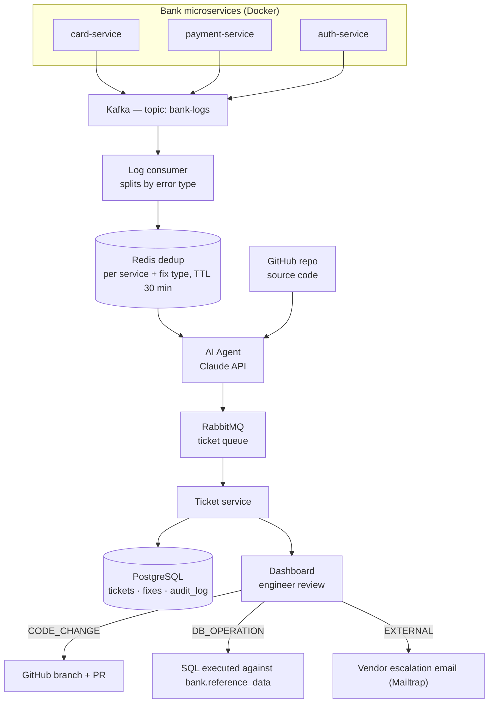

# Log Triage Agent

A prototype exploring **automatic healing**: can a system detect its own
errors from logs, diagnose them with an LLM, and propose (or apply) a fix
with minimal human involvement. Submitted as a project for Applied Cloud
Computing, University of Edinburgh, April 2026.

Spring Boot service that consumes application log events, uses the Claude API
to analyze and classify errors, and automatically opens/updates tickets
(with suggested code or SQL fixes) for on-call review. Log ingestion runs
through Kafka and RabbitMQ, ticket/audit state is persisted in Postgres via
JPA, and Redis is used for caching. Vendor escalation emails go out through
Mailtrap SMTP, and suggested fixes can be pushed to GitHub via the GitHub
API.

## Stack

- Java 21 / Spring Boot 3.2
- Kafka (log ingestion), RabbitMQ (ticket queue), Redis (cache)
- PostgreSQL + Spring Data JPA
- Claude API (log analysis / fix suggestions)
- GitHub API (fix PR/branch creation)
- Spring Mail (Mailtrap SMTP, vendor escalation)

## Architecture



Bank microservices publish logs via a Logback Kafka appender with no code
changes required. The log consumer splits incoming batches by error type
before the AI sees them, so a vendor timeout is never conflated with a code
bug in the same analysis call. Redis deduplicates per service + fix type
(30 min TTL) so a repeating error doesn't generate a new ticket — and,
therefore, a new AI API call — every time it recurs; instead it appends the
newly affected users to the existing open ticket. The AI agent reads the
log batch alongside the relevant service's source code from GitHub and
classifies the issue into one of five fix types:

| Fix type | Trigger | Action on approval |
|---|---|---|
| `CODE_CHANGE` | Bug in application source code | GitHub branch + pull request |
| `DB_OPERATION` | Missing or incorrect database entry | SQL executed against `bank.reference_data` |
| `EXTERNAL` | Third-party API or vendor failure | Escalation email sent via Mailtrap |
| `CONFIG_CHANGE` | Misconfigured property or environment variable | Manual action by ops team |
| `INVESTIGATION` | Insufficient information in the logs | Assigned for manual review |

Nothing is applied automatically — every diagnosis lands on the dashboard
as a ticket, and an engineer has to approve it before LogSentinel opens the
PR, runs the SQL, or sends the email. The SQL executor itself only ever
permits `INSERT`, `UPDATE`, and `SELECT` — `DROP`, `DELETE`, and `TRUNCATE`
are blocked at that layer regardless of what the AI proposes.

## Running locally

1. Copy the environment template and fill in your own credentials:

   ```bash
   cp local.env.example local.env
   ```

   `local.env` is git-ignored — never commit real values into it or into
   `src/main/resources/application.properties` (which reads them via
   `${ENV_VAR}` placeholders).

   | Variable | Purpose |
   |---|---|
   | `CLAUDE_API_KEY` | Claude API key used for log analysis / fix generation |
   | `GITHUB_TOKEN` | GitHub PAT used to open fix branches/PRs |
   | `GITHUB_OWNER` | GitHub org/user that owns the target repo |
   | `SPRING_MAIL_USERNAME` / `SPRING_MAIL_PASSWORD` | Mailtrap SMTP credentials for vendor escalation email |

2. Start the supporting services (Postgres, Redis, RabbitMQ, Kafka) — see
   `docker-compose.yml` if present locally, or point `application.properties`
   at your own instances.

3. Export the variables from `local.env` and run:

   ```bash
   export $(grep -v '^#' local.env | xargs)
   ./mvnw spring-boot:run
   ```

   Or build and run the container:

   ```bash
   ./mvnw clean package -DskipTests
   docker build -t acp4 .
   docker run --env-file local.env -p 8080:8080 acp4
   ```

## API

- `GET /api/tickets` — list tickets (optional `?status=` filter)
- `GET /api/tickets/{id}` — fetch a single ticket

See `TicketController` for the full surface.

## Security note

Earlier revisions of this repository committed real API keys and SMTP
credentials to `application.properties` / `local.env`. Those values have
since been rotated and the git history has been rewritten to remove them.
Config now only ever contains `${ENV_VAR}` placeholders — provide real
values via environment variables, never by editing tracked files.

## AI disclosure

This repository's maintenance was organized with the help of Claude
(Anthropic): scrubbing leaked credentials from git history, rewriting and
force-pushing the cleaned history, untracking `local.env`, and writing this
README and the LICENSE file. The application code and design are the
author's own work.
